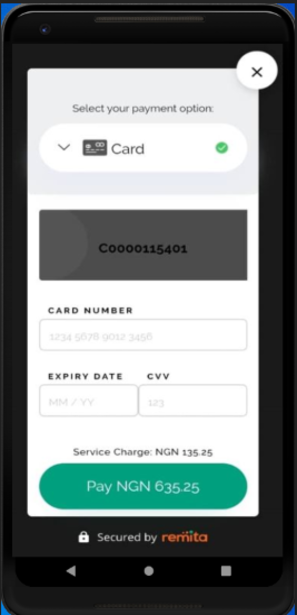

** **

# Remita Inline Payment SDK - Xamarin

 


## Table of Contents

**1.0 OVERVIEW**

**2.0 TRY IT NOW**


## OVERVIEW

The following pages outlines the steps to integrating Remita Inline Payment SDK to your app.

** **


# 2.0         TRY IT NOW

**Sample Code:**
```java

```

# 3.0         TEST CARDS
```json
              CARD: 5178 6810 0000 0002,  
              Expire Date : 05/30,  
              CCV: 000, 
              OTP: 123456
```